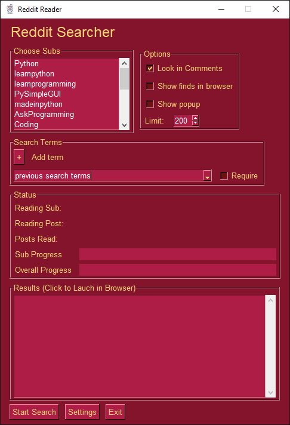

<p align="center">
  <p align="center"><p>

  <h2 align="center">psgreddit</h2>
  <h2 align="center">A PySimpleGUI Application</h2>
</p>

Search Your Favorite Reddit Subs


<p align="center"><p>


## Features

* Integrates PySimpleGUI with PRAW API
* Provides stating point for custom Reddit user interface
* Search your favorite subreddits and their comments

## Installation

### Using PIP with PyPI

The latest official release of PySimpleGUI products can be found on PyPI.  To pip install the demo applications from PyPI, use this command

#### If you use the command `python` on your computer to invoke Python (Windows):

`python -m pip install --upgrade psgreddit`

#### If you use the command `python3` on your computer to invoke Python (Linux, Mac):

`python3 -m pip install --upgrade psgreddit`

### Using PIP with GitHub

You can also pip install the PySimpleGUI Applications that are in the PySimpleGUI GitHub account.  The GitHub versions have bug fixes and new programs/features that have not yet been released to PyPI. To directly pip install from that repo:

#### If you use the command `python` on your computer to invoke Python (Windows):

```bash
python -m pip install --upgrade https://github.com/PySimpleGUI/psgreddit/zipball/main
```

#### If you use the command `python3` on your computer to invoke Python (Linux, Mac):

```bash
python3 -m pip install --upgrade https://github.com/PySimpleGUI/psgreddit/zipball/main
```


## Usage

Once installed, launch psgreddit by typing the following in your command line:

`psgreddit`

## Requirements

To use the GUI you'll need to install PySimpleGUI (http://www.PySimpleGUI.org for instructions)

One of these will install it for you.
```
pip install PySimpleGUI
pip3 install PySimpleGUI
```

You will also need to install the PRAW package which provides the APIs for accessing Reddit

## PRAW Credentials

You must signup with Reddit to in order to get own Reddit API credentials.

To sign up go to - https://www.reddit.com/prefs/apps/ 

For security reasons, the credentials are not stored in the source code, but instead in a "settings file".  The User Settings APIs were added to PySimpleGUI in Nov 2020 and are perfect for storing login credentials.  
    
When you first start the program, it will figure out that you don't have any credentials defined and will show you this settings window:
   
<p align="center"><p>


You can also use the "Settings" button in the main window to bring up the settings window.  

## Search History

The items you search for are stored in the settings file as well.  This makes future searches easier as you can select the search term from a drop-down list instead of typing them in.


## Running

Once the packages are installed, you only need to run the single Python file found in this repository - `Reddit_Searcher.py`

When running on Windows, launching with `pythonw` instead of plain `python` will start the program without showing a console window.

## License & Copyright

Copyright 2023-2024 PySimpleSoft, Inc. and/or its licensors.

This is a free-to-use "Utility" and is licensed under the
PySimpleGUI License Agreement, a copy of which is included in the
license.txt file and also available at https://pysimplegui.com/eula.

Please see Section 1.2 of the license regarding the use of this Utility,
and see https://pysimplegui.com/faq for any questions.


## Contributing

We are happy to receive issues describing bug reports and feature
requests! If your bug report relates to a security vulnerability,
please do not file a public issue, and please instead reach out to us
at issues@PySimpleGUI.com.

We do not accept (and do not wish to receive) contributions of
user-created or third-party code, including patches, pull requests, or
code snippets incorporated into submitted issues. Please do not send
us any such code! Bug reports and feature requests should not include
any source code.

If you nonetheless submit any user-created or third-party code to us,
(1) you assign to us all rights and title in or relating to the code;
and (2) to the extent any such assignment is not fully effective, you
hereby grant to us a royalty-free, perpetual, irrevocable, worldwide,
unlimited, sublicensable, transferrable license under all intellectual
property rights embodied therein or relating thereto, to exploit the
code in any manner we choose, including to incorporate the code into
PySimpleGUI and to redistribute it under any terms at our discretion.
